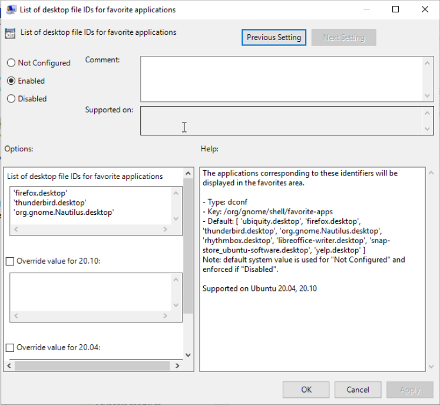

# Setting up the Active Directory Server

Active Directory needs policy files (**.admx** and **.adml**) to know which settings can be changed on given clients and actions to be performed on users of the domain.

As a rule of thumb, we generally separate the Ubuntu configuration from the Windows one to avoid incompatibilities:

* namespace conflicts
* forward vs backward slashes
* let the administrator know exactly what settings are supported on which client version.

## Ubuntu administrative template generations

**ADSys** ships with pre-built Active Directory administrative templates that you can install on your Active Directory server. You will find two flavors of them:

* One listing only Long Term Supported (LTS) Ubuntu versions.
* One listing all currently supported Ubuntu versions, including non LTS.

To get them, run `adsysctl policy admx lts-only`. It will create 2 files `Ubuntu.adml` and `Ubuntu.admx` in the current directory. As described, those will list only LTS versions of Ubuntu. To get all supported releases, replace `lts-only` with `all`.

Those are the 2 files that must be copied on your Active Directory server.

You can find the latest version of those files in a [dedicated directory of the upstream repository](https://github.com/ubuntu/adsys/tree/main/policies). Note though that not all the keys may be supported by our local `ADSys` installation. Only the templates generated by `adysctl` match the version of your client.

The policy files are also shipped as part of the `adsys-windows` package, together with the [Active Directory Watch Daemon](11.-Active-Directory-Watch-Daemon.md).

## Deployment of ADM files on the Active Directory server

The administrative templates for Ubuntu must be deployed on your Active Directory server in the policy definition directory corresponding to your forest root. For instance `\\example.com\sysvol\example.com\Policies\PolicyDefinitions` for the .admx file and `\\example.com\sysvol\example.com\Policies\PolicyDefinitions\en-US` for the .adml file. Theses directories can be created manually if they do not exist.

For more information read the Microsoft documentation ["create and manage the Central Store"](https://docs.microsoft.com/en-us/troubleshoot/windows-client/group-policy/create-and-manage-central-store).

Once loaded successfully in Active Directory, the Ubuntu specific settings are available in the **Group Policy Management Editor** under `[Policy Name] > Computer Configuration > Policies > Administrative Templates > Ubuntu` for the machine policies and `[Policy Name] > User Configuration > Policies > Administrative Templates > Ubuntu` for the user policies.

## Recommended readings

* `adsysctl help policy admx` or `man adsyctl-policy-admx`.
* [Create and manage the Central Store](https://docs.microsoft.com/en-us/troubleshoot/windows-client/group-policy/create-and-manage-central-store).
