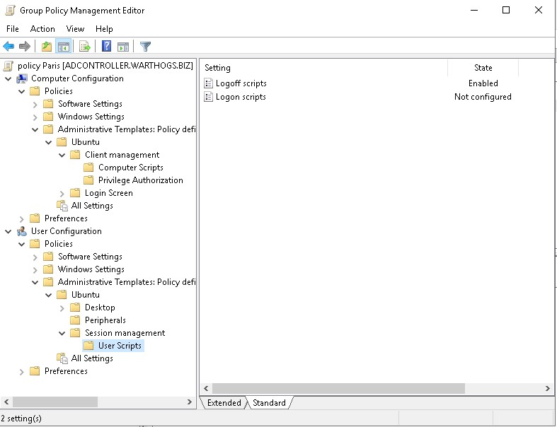
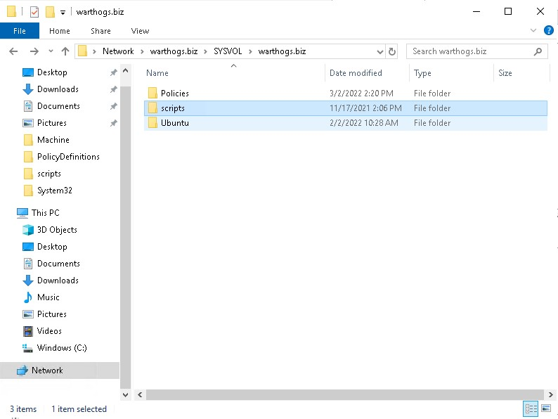
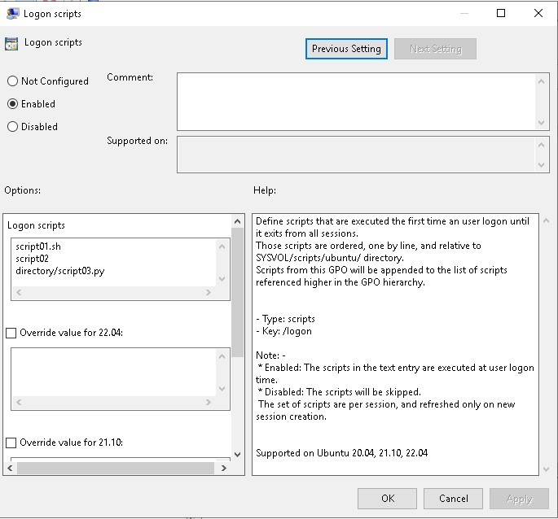

# Scripts execution

The scripts managers allows AD administrators to target scripts to be executed on behalf of the client, or by users.

Those scripts, can be triggered on:

* Computer startup and shutdown. They are located in `Computer Configuration > Policies > Administrative Templates > Ubuntu > Client management > Computer Scripts`.
* User log on and log off. They are located in `User Configuration > Policies > Administrative Templates > Ubuntu > Session management > User Scripts`.

Scripts can be shell scripts, or any binary that can be executed on Linux.



## Feature availability

This feature is available only for the subscribers of the **Ubuntu Advantage** offer.

## Rules precedence

Any settings will be additive to the same settings in less specific GPO. It means that scripts in the less specific GPO will be executed first.

## Installing scripts on sysvol

Scripts must be available in the assets sharing directory on your Active Directory `sysvol/` samba share.

In this directory, next to `Policies` in your domain folder, create a directory matching your distribution name. For instance `Ubuntu`, which will be the assets sharing directory.



It must also contain a `GPT.ini` file of the form:

```ini
[General]
Version=22
displayName=Ubuntu Assets Directory
```

Every time you change the scripts, you need to increase the version stanza in the `GPT.ini` file (similarly to how Active Directory is doing automatically when you change any field). This will signal clients that a new version of assets (including scripts) are available and should be downloaded.

Then, place any scripts you need under the `scripts/` directory (subdirectories are allowed).

## Automating the incrementation of the `GPT.ini` version stanza

Making manual changes to a file everytime scripts are changed can be unproductive and tedious. For your convenience, we developed a tool to automate this process. For detailed usage and installation instructions please refer to the [Active Directory Watch Daemon](11.-Active-Directory-Watch-Daemon.md) documentation.

## Active directory UI

### Enabled

The form is a list of scripts path, relative to the `scripts/` subdirectory of your assets sharing filesystem, one per line.



### Not configured or Disabled

This GPO won’t refer any scripts for execution.

## Scripts behaviours

### Scripts erroring out

If a script errors out on execution, it will not fail the session startup or the machine boot. However, some errors details will be available in systemd journal.

### Incorrect script path reference

If a script referenced by a GPO doesn’t exist or that the path is incorrect, then the policy will fail to be applied and any client startup or user log on will fail.

## Transactional sessions

Scripts sessions are transitional: if you installed V1 of some scripts, and starts a session (computer startup or user log on), then you can be ensured that whatever version is updated on the Active Directory, you will exit the session with the same V1 version of the scripts you initially provided (computer log off or user log off).

However, even if **user1** has logged on with version V1 of the scripts and V2 is available, then any log on for **user2** will use the V2 of the scripts. **user1** though, is ensured to continue using the V1 version of the scripts.
