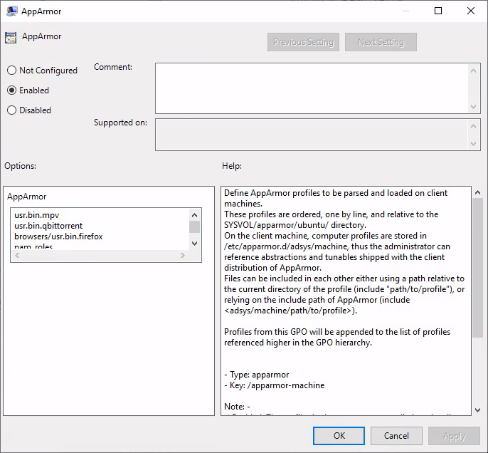

# Managing AppArmor profiles

The AppArmor manager allows to enforce custom [AppArmor](https://apparmor.net/) profiles on the client.

Custom AppArmor profiles can be enforced on a:

* System-wide level, located in `Computer Configuration > Policies > Administrative Templates > Ubuntu > Client management > System-wide application confinement > AppArmor`
* User level, located in `Computer Configuration > Policies > Administrative Templates > Ubuntu > Session management > User application confinement > AppArmor`

## Feature availability

This feature is available only for the subscribers of the **Ubuntu Advantage** offer.

## Rules precedence

On a system-wide level, files in the entry are appended to the list of profiles referenced higher in the GPO hierarchy.

On a user level, the configured profile will override any profile referenced higher in the GPO hierarchy.

## Installing AppArmor profiles on sysvol

AppArmor profiles must be available in the assets sharing directory on your Active Directory `sysvol/` samba share.

In this directory, next to `Policies` in your domain folder, create a directory matching your distribution name. For instance `Ubuntu`, which will be the assets sharing directory.


It must also contain a `GPT.ini` file of the form:

```ini
[General]
Version=22
displayName=Ubuntu Assets Directory
```

Every time you change the contents of AppArmor profiles, you need to increase the version stanza in the `GPT.ini` file (similarly to how Active Directory is doing automatically when you change any field). This will signal clients that a new version of assets (including AppArmor profiles) are available and should be downloaded.

Then, place any AppArmor profiles you need under the `apparmor/` directory (subdirectories are allowed).

### Automating the incrementation of the `GPT.ini` version stanza

Making manual changes to a file everytime AppArmor profiles are changed can be unproductive and tedious. For your convenience, we developed a tool to automate this process. For detailed usage and installation instructions please refer to the [Active Directory Watch Daemon](12.-Active-Directory-Watch-Daemon.md) documentation.

## Developing AppArmor profiles

We highly recommend developing AppArmor profiles separately from ADSys, testing them, and only then integrating them with ADSys. Here are some resources to get you started:

- https://ubuntu.com/tutorials/beginning-apparmor-profile-development#1-overview
- https://gitlab.com/apparmor/apparmor/-/wikis/Documentation
- https://medium.com/information-and-technology/so-what-is-apparmor-64d7ae211ed

## System-wide profiles

The form is a list of AppArmor profile paths, relative to the `apparmor/` subdirectory of your assets sharing filesystem, one per line.



When set to enabled, adsys will load the configured AppArmor profiles on refresh. AppArmor's caching functionality is leveraged to ensure redundant reloads are kept to a minimum, i.e. a loaded profile will be reparsed only if a change occurred in the profile definition.

On the client machine, system-wide profiles are located under `/etc/apparmor.d/adsys/machine` by default.

When set disabled / not configured, ADSys will unload any previously loaded profiles (that were managed by ADSys) from the client machine.

## User profiles

AppArmor supports confining executables on a user-by-user basis via the [`pam_apparmor` PAM module](https://gitlab.com/apparmor/apparmor/-/wikis/Pam_apparmor). The module allows applications to confine authenticated users into subprofiles based on group names, user names, or a default profile. To accomplish this, `pam_apparmor` needs to be registered as a PAM session module. A [working example](https://gitlab.com/apparmor/apparmor/-/wikis/Pam_apparmor_example) can be found on the official AppArmor repository wiki.

The form accepts a path to a single file, relative to the `apparmor/` directory of your assets sharing filesystem.


### Installing the AppArmor PAM module

The PAM module can be installed on Ubuntu using the following command:
```
sudo apt install libpam-apparmor
```

The module must then be configured manually for any desired executables. To enable it for the `su` command, append the following to the `/etc/pam.d/su` file:

```
session optional pam_apparmor.so order=user,default
```

> **Warning**
> Even though GPOs can be applied to AD groups, the AppArmor policy manager currently only supports confining AD users, so we've omitted `group` from the PAM order.

### User profile declaration syntax

As per the example linked above, the user profile is essentially a subprofile (also known as a *hat*) which needs to be included in the actual executable profile definition. The PAM module will then attempt to change *hats* into a subprofile containing the target user's name.

If a regular subprofile looks like the following (assuming `admin@domain.com` is the user we want to confine):

```apparmor
^admin@domain.com {
  #include <abstractions/authentication>
  #include <abstractions/nameservice>
  capability dac_override,
  capability setgid,
  capability setuid,
  /etc/default/su r,
  /etc/environment r,
  @{HOMEDIRS}/.xauth* w,
  /bin/{,b,d,rb}ash Ux,
  /bin/{c,k,tc}sh Ux,
}
```

Its ADSys counterpart will omit the first and last lines which will be inferred automatically when policies are applied on the client machine. Thus, the subprofile declaration becomes:

```apparmor
#include <abstractions/authentication>
#include <abstractions/nameservice>
capability dac_override,
capability setgid,
capability setuid,
/etc/default/su r,
/etc/environment r,
@{HOMEDIRS}/.xauth* w,
/bin/{,b,d,rb}ash Ux,
/bin/{c,k,tc}sh Ux,
```

When the policy is applied on the target machine, the user profile will be created in `/etc/apparmor.d/adsys/users/admin@domain.com`.

The user profile doesn't accomplish anything on its own until it is included in a system-wide profile definition. We recommend including the entire `users` directory in the profile declaration, as evidenced by the official `pam_apparmor` documentation.

It is also recommended to define a `DEFAULT` subprofile as part of the system-wide profiles to ensure `pam_apparmor` has a profile to switch to as a last resort if it cannot find a profile for the user.

```apparmor
/usr/bin/su {
  ...
  include "users"

  ^DEFAULT {
     capability dac_override,
     capability setgid,
     capability setuid,
     /etc/default/su r,
     /etc/environment r,
     @{HOMEDIRS}/.xauth* w,
     /usr/bin/{,b,d,rb}ash Px -> default_user,
     /usr/bin/{c,k,tc}sh Px -> default_user,
   }
}
```

## Profile parsing behaviours

### Troubleshooting misbehaving user profiles

If you encounter issues with user profiles, it's always helpful to check the kernel buffer (`dmesg`) and the authentication logs at `/var/log/auth.log`. Additionally, appending `debug` to the PAM module declaration stanzas at `/etc/pam.d/` will log additional debug information, such as the profile that the module tries to switch to.

```
Nov 18 13:55:48 ubuntu2204 su: pam_unix(su:session): session opened for user administrator@warthogs.biz(uid=1130200500) by root(uid=0)
Nov 18 13:55:48 ubuntu2204 su: pam_apparmor(su:session): Using username 'administrator@warthogs.biz'
```

In contrast, switching to a user with no declared profile and no default profile will print the following and restrict access entirely:

```
Nov 18 14:00:22 ubuntu2204 su: pam_unix(su:session): session opened for user fry@warthogs.biz(uid=1130201105) by root(uid=0)
Nov 18 14:00:22 ubuntu2204 su: pam_apparmor(su:session): Using username 'fry@warthogs.biz'
Nov 18 14:00:22 ubuntu2204 su: pam_apparmor(su:session): Using DEFAULT
Nov 18 14:00:22 ubuntu2204 su: pam_apparmor(su:session): Can't change to any hat
Nov 18 14:00:22 ubuntu2204 su: pam_unix(su:session): session closed for user fry@warthogs.biz
```

The PAM module goes through the order specified in the configuration (user, default), ultimately bailing and denying access if it cannot find any hat to switch to.

### Error on loading profiles

ADSys relies on the `apparmor_parser` executable to parse, load, and unload profiles. If the command fails for any reason (e.g. syntax errors in profile declaration), loading profiles will be aborted and the output of the `apparmor_parser` command will be logged.

```
ERROR Error from server: error while updating policy: failed to apply policy to "ubuntu2204": can't apply apparmor policy to ubuntu2204: can't apply machine policy: failed to get apparmor policies: exit status 1
AppArmor parser error for /etc/apparmor.d/adsys/machine/pam_roles in profile /etc/apparmor.d/adsys/machine/pam_roles at line 9: Lexer found unexpected character: '<' (0x3c) in state: INITIAL 
```

### Invalid profile path reference

If an AppArmor profile referenced by a GPO doesn't exist or the path is incorrect, then the policy will fail to be applied and any client startup or user log on will fail.
