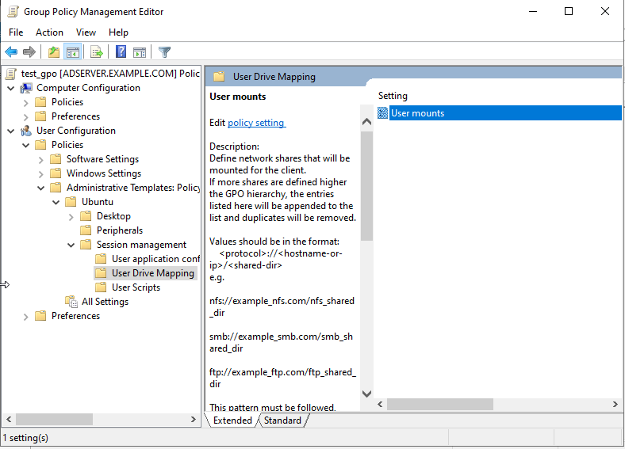

# Network shares

The mount managers allow AD administrators to specify network shares that must be mounted in the filesystem when a client logs in.

## Feature Availability

This feature is available only for subscribers of **Ubuntu Pro**.

## System mounts

The mount process for these mounts is triggered at the moment a client logs in. System mounts are handled by systemd through unit files and happen at root level. Therefore, users do not have control over the mounting / unmounting process.

All protocols supported by the [mount command](https://manpages.ubuntu.com/manpages/jammy/en/man8/mount.8.html) should work out of the box. However, the only tested ones are `smb`, `ftp` and `nfs`.

The backends for the protocols `smb` and `nfs` are automatically enabled when installing the adsys package. In order to enable the backend for `ftp` mounts, the user must install the recommended `curlftpfs` package. This behaviour is tested on Ubuntu and might differ on other Linux distributions.

Access control and file permissions should be configured on the shared location.

User mount policies are located under `Computer Configuration > Policies > Administrative Templates > Ubuntu > Client management > System Drive Mapping`, as shown in the following picture.

### Setting up the policy

The form is a list of shared drives that should be mounted for the client machine. They must follow the structure `{protocol}://{hostname or ip}/{shared location}`.

The default mount behavior is to mount the listed shares anonymously. In order to require kerberos authentication for the mount process, the tag `[krb5]` can be added as a prefix to the listed share, i.e. `[krb5]{protocol}://{hostname or ip}/{shared location}`.

Additional mount options are not supported yet.

All entries must be separated by a line break.

### Rules precedence

The policy strategy is "append". Therefore, if multiple policies defining network shares are to be applied to a client, all of the listed shares will be mounted.

Duplicated shares will be handled. Anonymous and authenticated shares of the same location are treated as duplicates and the first one listed will take precedence over the others.

### Errored mounts

ADSys will block the client authentication only if the policy could not be applied, i.e. listed shares could not be set up. Anything that occurs after the set up process, i.e. unreachable domain, share non-existent, among others, will only be reported as an error. Check system logs to see more about the failure details.

### Unmounting

The unmounting process is handled by systemd on shutdown.

## User mounts

The mount process for these mounts is triggered at the moment a user logs in. User mounts are accessible in the file manager and the user has the ability to unmount them manually.

Credentials authentication for mounts are disabled on adsys. Instead, authentication is done with the Kerberos ticket present on the machine. If the mount is set to anonymous, then the administrator must ensure that the shared drive supports anonymous access and that the permissions for the directory are set accordingly.

User mount policies are located under `User Configuration > Policies > Administrative Templates > Ubuntu > Session management > User Drive Mapping`, as shown in the following picture.

### Setting up the policy

The form is a list of shared drives that should be mounted for the user. They must follow the structure {protocol}://{hostname or ip}/{shared location}. If the drive is to be mounted anonimously, the tag [anonymous] should be added as a prefix to the listed entry, i.e. [anonymous]{protocol}://{hostname or ip}/{shared location}.

All entries must be separated by a line break.

The mount process is handled with gvfs and it defines in which directory the shared drive will be mounted into. Usually, it's mounted under `/run/user/%U/gvfs/`.

### Rules precedence

The policy strategy is "append". Therefore, if multiple policies defining mount locations are to be applied to a user, all of the listed entries will be mounted.

### Errored mounts

Should the mounting of a entry listed in the policy fail, adsys will continue through the other entries listed in the policy, mounting the ones that it can and logging the ones that could not be mounted.

### Unmounting

The unmounting process is handled by systemd at the end of the session.
