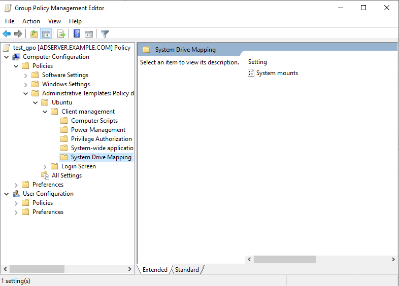
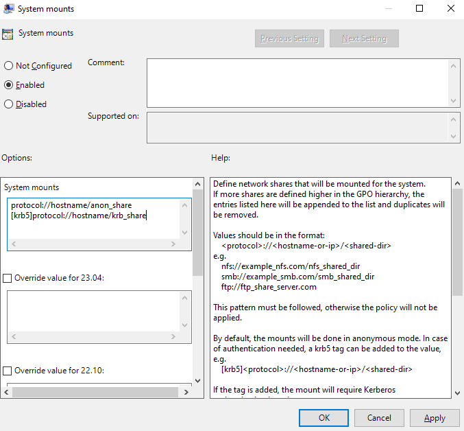

# Network shares

The mount managers allow AD administrators to specify network shares that must be mounted in the filesystem when a client logs in.

## Feature Availability

This feature is available only for subscribers of **Ubuntu Pro**.

## System mounts

The mount process for these mounts is triggered at the moment a client logs in. System mounts are handled by systemd through unit files and happen at root level. Therefore, users do not have control over the mounting / unmounting process.

Access control and file permissions should be configured on the shared location.

User mount policies are located under `Computer Configuration > Policies > Administrative Templates > Ubuntu > Client management > System Drive Mapping`, as shown in the following picture.

### Setting up the policy

The form is a list of shared drives that should be mounted for the client machine. They must follow the structure `{protocol}://{hostname or ip}/{shared location}`.

The default mount behavior is to mount the listed shares anonymously. In order to require kerberos authentication for the mount process, the tag `[krb5]` can be added as a prefix to the listed share, i.e. `[krb5]{protocol}://{hostname or ip}/{shared location}`.

All entries must be separated by a line break.

### Rules precedence

The policy strategy is "append". Therefore, if multiple policies defining network shares are to be applied to a client, all of the listed shares will be mounted.

Duplicated shares will be handled. Anonymous and authenticated shares of the same location are treated as duplicates and the first one listed will take precedence over the others.

### Errored mounts

ADSys will block the client authentication only if the policy could not be applied, i.e. listed shares could not be set up. Aything that occurs after the set up process, i.e. unreachable domain, share non existant, among others, is not ADSys responsibility and will not be addressed.

### Unmounting

The unmounting process is handled by systemd at the end of the session.
