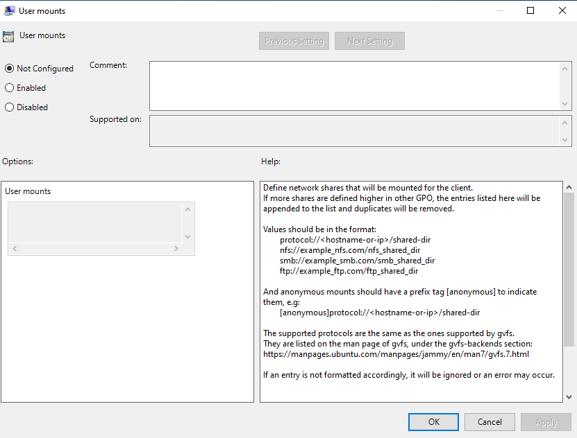

# Network shares

The mount managers allow AD administrators to specify network shares that must be mounted in the filesystem when the client logs in.

Currently, the supported protocols are samba and nfs.

## Feature Availability

This feature is available only for subscribers of **Ubuntu Pro**.

## User mounts

The mount process for these mounts is triggered at the moment a user logs in. User mounts are made at user level with gio and, as such, are shown on Nautilus and the user has the ability to unmount them manually.

Access control and file permissions should be configured on the server.

User mount policies are located under `User Configuration > Policies > Administrative Templates > Ubuntu > Session management > User Drive Mapping`, as shown in the following picture.

### Setting up the policy

The form is a list of shared drives that should be mounted for the user. They must follow the structure {protocol}://{hostname or ip}/{shared location}. If the drive is to be mounted anonimously, the tag [anonymous] should be added as a prefix to the listed entry, i.e. [anonymous]{protocol}://{hostname or ip}/{shared location}.

All entries must be separated by a linebreak.

### Rules precedence

The policy strategy is "append". Therefore, if multiple policies defining mount locations are to be applied to a user, all of the listed entries will be mounted.

### Errored mounts

Should the mounting of a entry listed in the policy fail, adsys will continue through the other entries listed in the policy, mounting the ones that it can and logging the ones that could not be mounted.

### Unmounting

The unmounting process is handled by systemd at the end of the session.
