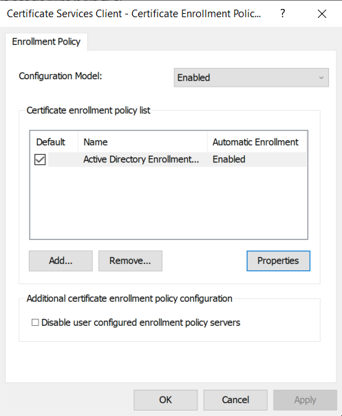

# Certificate auto-enrollment

The certificate policy manager allows clients to enroll for certificates from **Active Directory Certificate Services**. Certificates are then continuously monitored and refreshed by the [`certmonger`](https://www.freeipa.org/page/Certmonger) daemon. Currently, only machine certificates are supported.

Unlike the other ADSys policy managers which are configured in the special Ubuntu section provided by the ADMX files (Administrative Templates), settings for certificate auto-enrollment are configured in the Microsoft GPO tree:

* Computer Configuration > Policies > Windows Settings > Security Settings > Public Key Policies > Certificate Services Client - Auto-Enrollment


## Feature availability

This feature is available only for subscribers of **Ubuntu Pro** and has been tested and known to work on all Ubuntu versions starting with 22.04 (Jammy).

Additionally, the following packages must be installed on the client in order for auto-enrollment to work:

- [`certmonger`](https://www.freeipa.org/page/Certmonger) - daemon that monitors and updates certificates
- [`cepces`](https://github.com/openSUSE/cepces) - `certmonger` extension that can communicate with **Active Directory Certificate Services**

On Ubuntu systems, run the following to install them:
```sh
sudo apt install certmonger python3-cepces
```

On the Windows side, the following roles must be installed and configured:
- Certification Authority
- Certificate Enrollment Policy Web Service
- Certificate Enrollment Web Service
- Network Device Enrollment Service

## Rules precedence

Auto-enrollment configuration will override any settings referenced higher in the GPO hierarchy.

## Policy configuration

Certificate auto-enrollment is configured by setting the **Configuration Model** to **Enabled** and ticking the following checkbox: **Update certificates that use certificate templates**.


The policy can be disabled by performing _any_ of the following:
- unticking the **Update certificates that use certificate templates** checkbox
- setting the **Configuration Model** to **Disabled** or **Not configured**

The other settings in this GPO entry do not affect ADSys in any way.

For more advanced configuration, a list of policy servers can be specified in the following GPO entry:
* Computer Configuration > Policies > Windows Settings > Security Settings > Public Key Policies > Certificate Services Client - Certificate Enrollment Policy



## Applying the policy

On the client system, a successful auto-enrollment will place certificate data in the following paths:
- `/var/lib/adsys/certs` - certificate data
- `/var/lib/adsys/private/certs` - private key data
- `/usr/local/share/ca-certificates` - root certificate data (symlinks pointing to `/var/lib/adsys/certs`)

For detailed information on the tracked certificates, `certmonger` can be directly interacted with:

```sh-session
# Query monitored certificates
> getcert list
Number of certificates and requests being tracked: 1.
Request ID 'galacticcafe-CA.Machine':
	status: MONITORING
	stuck: no
	key pair storage: type=FILE,location='/var/lib/adsys/private/certs/galacticcafe-CA.Machine.key'
	certificate: type=FILE,location='/var/lib/adsys/certs/galacticcafe-CA.Machine.crt'
	CA: galacticcafe-CA
	issuer: CN=galacticcafe-CA,DC=galacticcafe,DC=com
	subject: CN=keypress.galacticcafe.com
	issued: 2023-08-18 18:44:27 EEST
	expires: 2024-08-17 18:44:27 EEST
	dns: keypress.galacticcafe.com
	key usage: digitalSignature,keyEncipherment
	eku: id-kp-clientAuth,id-kp-serverAuth
	certificate template/profile: Machine
	profile: Machine
	pre-save command:
	post-save command:
	track: yes
	auto-renew: yes

# Query known CAs
> getcert list-cas
(...)
CA 'galacticcafe-CA':
	is-default: no
	ca-type: EXTERNAL
	helper-location: /usr/libexec/certmonger/cepces-submit --server=win-mk85nrq26nu.galacticcafe.com --auth=Kerberos
```

## Policy implementation

With the exception of policy parsing, ADSys leverages the Samba implementation of certificate auto-enrollment. As this feature is only available in newer versions of Samba, we have taken the liberty of vendoring the required Samba files to allow this policy to work on Ubuntu versions that ship an older Samba version. These files are shipped in `/usr/share/adsys/python/vendor_samba`.

To ensure idempotency when applying the policy, we set up a Samba [TDB cache file](https://wiki.samba.org/index.php/TDB) at `/var/lib/adsys/samba/cert_gpo_state_$(hostname).tdb` which contains various information pertaining to the enrolled certificate(s).

Here is an overview of what happens during policy application:
- GPO parsing (ADSys)
- execute Python helper script (ADSys)
- fetch root CA and policy servers (Samba)
- start monitoring certificate using `certmonger` and `cepces` (Samba)

## Troubleshooting

### Some dependencies are not available in the client Ubuntu installation

While `certmonger` has been available for a while in Ubuntu, `python3-cepces` is a new package, available starting with Ubuntu 23.10 (Mantic). If unavailable on the client version, it can also be manually installed from the [source repository](https://github.com/openSUSE/cepces). The certificate policy manager only checks for the existence of the `cepces-submit` and `getcert` binaries, not their respective packages, in order to allow some wiggle room for this.

### Manipulating certificates with `getcert`

While not encouraged, certificates can be manipulated with the same tool. This could be helpful for debugging purposes.

```sh-session
# Regenerate a certificate
> getcert rekey -i galacticcafe-CA.Machine
Resubmitting "galacticcafe-CA.Machine" to "galacticcafe-CA".

# Unmonitor a certificate
> getcert stop-tracking -i galacticcafe-CA.Machine
Request "galacticcafe-CA.Machine" removed.

# Remove CA
getcert remove-ca -c galacticcafe-CA
```

Note that tampering with certificate data outside of ADSys (e.g. manually unmonitoring using `getcert`) will render the GPO cache obsolete as it will cause a drift between the actual state and the "known" cached state. In this case, it's best to remove the cache file at `/var/lib/adsys/samba/*.tdb` together with any enrolled certificates and CAs to ensure a clean slate.

### Debugging auto-enroll script

While certificate parsing happens in ADSys itself, enrollment is done via an embedded Python helper script. For debugging purposes, it can be dumped to the current directory and made executable by executing the following commands:
```sh-session
> adsysctl policy debug cert-autoenroll-script
> chmod +x ./cert-autoenroll
```

Before executing the script manually, the following environment variables have to be set:
```sh
export PYTHONPATH=/usr/share/adsys/python
export KRB5CCNAME=/var/run/adsys/krb5cc/$(hostname)
```

Then, run the script passing the required arguments (the argument list is also printed in the ADSys debug logs during policy application):
```sh-session
# Un-enroll machine
./cert-autoenroll unenroll keypress galacticcafe.com --state_dir /var/lib/adsys --debug
```

### Errors communicating with the CEP/CES servers

If ADSys successfully applies the policy but `getcert list` does not list the certificates or they are in an unexpected state, check the `certmonger` logs for details (`journalctl -u certmonger`). Additionally, debug logging for `cepces` can be enabled by editing the logging configuration at `/etc/cepces/logging.conf`.

The `cepces` configuration itself is batteries-included, meaning it should work out of the box for most setups. All configuration options are documented and configurable at `/etc/cepces/cepces.conf`.

## Additional information

While configuring Active Directory Certificate Services is outside the scope of the policy manager documentation, we have found the following resources to be useful:
- https://www.virtuallyboring.com/setup-microsoft-active-directory-certificate-services-ad-cs/
- https://leonelson.com/2011/08/15/how-to-increase-your-csr-key-size-on-microsoft-iis-without-removing-the-production-certificate/

## Acknowledgements

We would like to thank the Samba team for making great strides in the research and implementation of certificate auto-enrollment via Active Directory Certificate Services.
