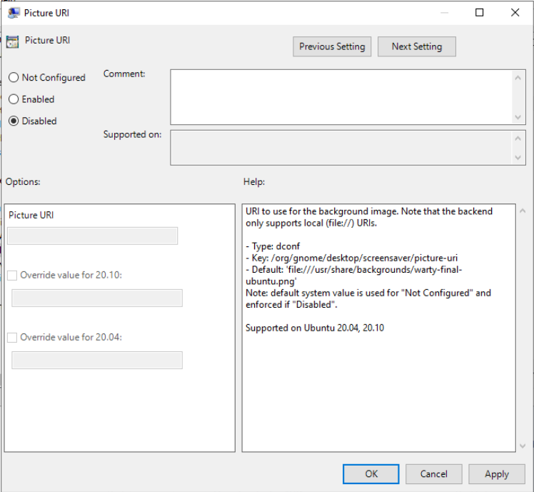

# Dconf manager

The dconf manager allows to enforce default or custom [dconf settings](https://wiki.gnome.org/Projects/dconf/SystemAdministrators) on the client.

Some settings are globally enforced on the machine while other are per-user specific settings.

## Example of settings

- Change the login screen layout and background color.
- Set and lock the default applications in the launcher.
- Set and lock the user wallpaper.
- Set the date and time format of the clock.

## Rules precedence

Any settings will override the same settings in less specific GPO.

## Settings UI

### Widgets

Depending on the type of settings, appropriate widgets are displayed to the AD system administrator. Those can be different per release if the type of settings changed.

### States

#### Enabled

Setting a key to `enabled` will apply a value to any machines or user targeted by the GPO.
It allows the Active Directory administrator to enter a value that will be applied to the target object (user or machine). This setting will be enforced on the client. Only an administrator of the client system can override it, but it will be reset to the Active Directory setting on next refresh.

#### Disabled

Setting a key to `disabled` will prevent user updates. However, no value can be explicitly entered by the Active Directory administrator. The default value of the client system will then be used (which may differ between machines).

#### Not configured

Finally, `not configured` is the default state. The setting is managed as usual directly on the client and without Active Directory.

