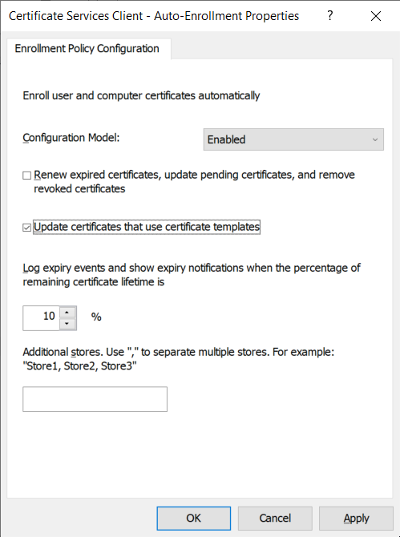
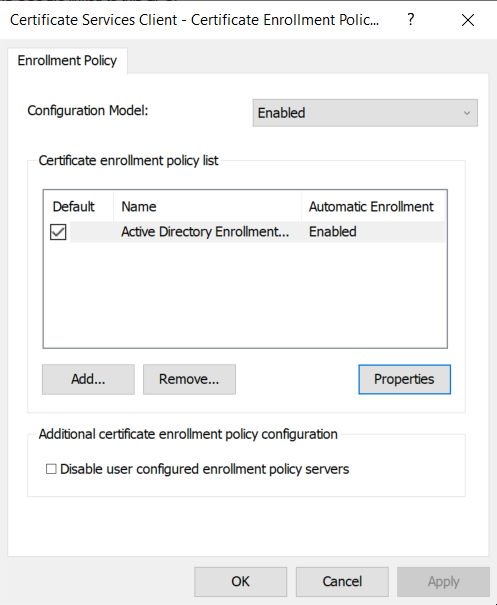

---
myst:
  html_meta:
    description: "Steps to configure certificate auto-enrollment with ADSys."
---

(howto::certificates-configure)=
# Configure certificate auto-enrollment

```{include} ../../pro_content_notice.txt
    :start-after: <!-- Include start pro -->
    :end-before: <!-- Include end pro -->
```

Certificate auto-enrollment is a key component of Ubuntu’s Active Directory GPO support. 
This feature enables clients to seamlessly enroll for certificates from Active Directory Certificate Services.

## Rules precedence

Auto-enrollment configuration will override any settings referenced higher in the GPO hierarchy.

## Policy configuration

Certificate auto-enrollment is configured by setting the **Configuration Model** to **Enabled** and ticking the following checkbox: **Update certificates that use certificate templates**.



The policy can be disabled by performing _any_ of the following:

* unticking the **Update certificates that use certificate templates** checkbox
* setting the **Configuration Model** to **Disabled** or **Not configured**

The other settings in this GPO entry do not affect ADSys in any way.

For more advanced configuration, a list of policy servers can be specified in the following GPO entry:

* `Computer Configuration > Policies > Windows Settings > Security Settings > Public Key Policies > Certificate Services Client - Certificate Enrollment Policy`



## Applying the policy

On the client system, a successful auto-enrollment will place certificate data in the following paths:

* `/var/lib/adsys/certs` - certificate data
* `/var/lib/adsys/private/certs` - private key data
* `/usr/local/share/ca-certificates` - root certificate data (symbolic link pointing to `/var/lib/adsys/certs`)

For detailed information on the tracked certificates, `certmonger` can be directly interacted with:

```output
# Query monitored certificates
> getcert list
Number of certificates and requests being tracked: 1.
Request ID 'galacticcafe-CA.Machine':
 status: MONITORING
 stuck: no
 key pair storage: type=FILE,location='/var/lib/adsys/private/certs/galacticcafe-CA.Machine.key'
 certificate: type=FILE,location='/var/lib/adsys/certs/galacticcafe-CA.Machine.crt'
 CA: galacticcafe-CA
 issuer: CN=galacticcafe-CA,DC=galacticcafe,DC=com
 subject: CN=keypress.galacticcafe.com
 issued: 2023-08-18 18:44:27 EEST
 expires: 2024-08-17 18:44:27 EEST
 dns: keypress.galacticcafe.com
 key usage: digitalSignature,keyEncipherment
 eku: id-kp-clientAuth,id-kp-serverAuth
 certificate template/profile: Machine
 profile: Machine
 pre-save command:
 post-save command:
 track: yes
 auto-renew: yes

# Query known CAs
> getcert list-cas
(...)
CA 'galacticcafe-CA':
 is-default: no
 ca-type: EXTERNAL
 helper-location: /usr/libexec/certmonger/cepces-submit --server=win-mk85nrq26nu.galacticcafe.com --auth=Kerberos
```
