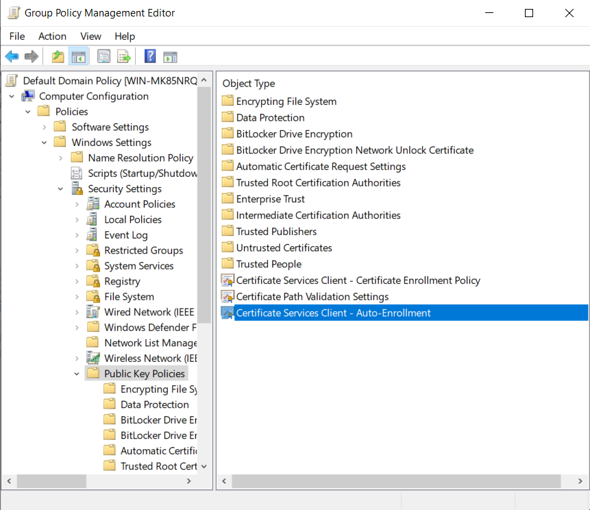

---
myst:
  html_meta:
    description: "Steps to set up certificate auto-enrollment for ADSys."
---

(howto::certificates-setup)=
# Set up certificate auto-enrollment

```{include} ../../pro_content_notice.txt
    :start-after: <!-- Include start pro -->
    :end-before: <!-- Include end pro -->
```

Certificate auto-enrollment is a key component of Ubuntu’s Active Directory GPO support. 
This feature enables clients to seamlessly enroll for certificates from Active Directory Certificate Services.

The certificate policy manager allows clients to enroll for certificates from **Active Directory Certificate Services**. Certificates are then continuously monitored and refreshed by the [`certmonger`](https://www.freeipa.org/page/Certmonger) daemon. Currently, only machine certificates are supported.

Unlike the other ADSys policy managers which are configured in the special Ubuntu section provided by the ADMX files (Administrative Templates), settings for certificate auto-enrollment are configured in the Microsoft GPO tree:

* `Computer Configuration > Policies > Windows Settings > Security Settings > Public Key Policies > Certificate Services Client - Auto-Enrollment`



## Prerequisites

### Active directory

You will need an installation of ADSys on a client Ubuntu Machine and the client should be joined to an {term}`Active Directory` (AD) domain.
Please refer to our how-to guides on setting up the Ubuntu client machine:

- [Join machine to AD during installation](../../how-to/join-ad-installation.md)
- [Join machine to AD manually](../../how-to/join-ad-manually.md)
- [Install ADSys](../../how-to/set-up-adsys.md)

For the Windows {term}`domain controller`, refer to:

- [Set up AD](../../how-to/set-up-ad.md)

### Required packages

The following packages must be installed on the client in order for auto-enrollment to work:

* [`certmonger`](https://www.freeipa.org/page/Certmonger) — daemon that monitors and updates certificates
* [`cepces`](https://github.com/openSUSE/cepces) — `certmonger` extension that can communicate with **Active Directory Certificate Services**

On Ubuntu systems, run the following to install them:

```bash
sudo apt install certmonger python3-cepces
```

On the Windows side, the following roles must be installed and configured:

* `Certification Authority`
* `Certificate Enrollment Policy Web Service`
* `Certificate Enrollment Web Service`
