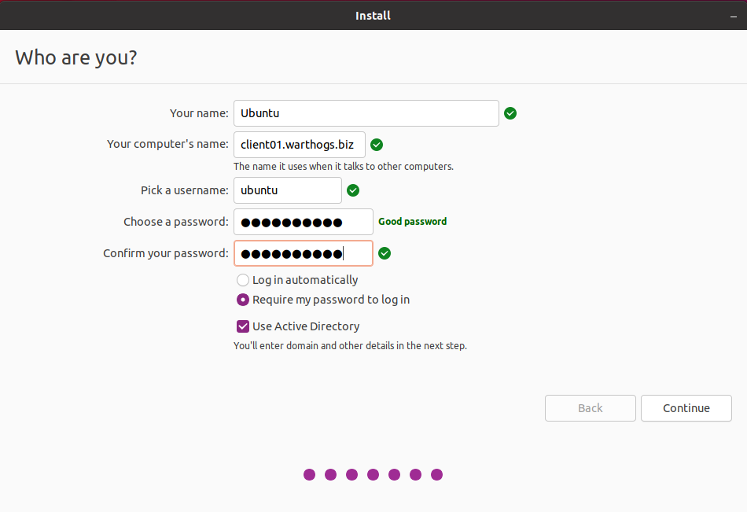

(howto::join-installer)=
# How to join Ubuntu Desktop to an Active Directory domain during installation

To use Group Policies on an Ubuntu client, the client machine first needs to be joined to an Active Directory (AD) domain.

This guide shows you how to join an AD domain at installation time with the Ubuntu Desktop installer.

```{tip}
Read our separate guide for [manually joining a machine to AD](join-ad-manually.md).
```

## Join at installation time

Joining during installation is supported by the Ubuntu Desktop graphical installer.

### Entering user and computer information

Start an installation of Ubuntu Desktop.

On the "Who are you?" screen, enter details for your user and computer.



To set and resolve the host name properly, you must enter the Fully Qualified Domain Name (FQDN) of the machine in the field "Your computer's name".
For example, use the FQDN `host01.example.com` instead of the corresponding host name `host01`.

After installation, you can check if these details with the following commands:

* The `hostname` command: Returns the name of the machine (`host01`)
* The `hostname -f` command: Returns the full name of the machine with the domain (`host01.example.com`)

Check the box **Use Active Directory** and then continue to the next step.

### Configuring Active Directory

Enter the address of the Active Directory controller and the credentials of the user allowed to add machines to the domain.


Verify that the server is reachable by clicking **Test Connection**.

Once all the information has been entered and is valid, the AD join configuration is complete.
Continuing from here will take you through usual steps of the installation.

### Logging in as a domain user

After the installation is complete, reboot the machine and log in as a user of the domain.

If anything goes wrong with the join process during installation, you will be notified by a dialog box.

For troubleshooting, you can reboot the machine and log in as the administrator user of the machine, which is the user you entered in the "Who are you?" screen.

This [Ubuntu Server guide](https://ubuntu.com/server/docs/service-sssd) provides relevant troubleshooting instructions.
