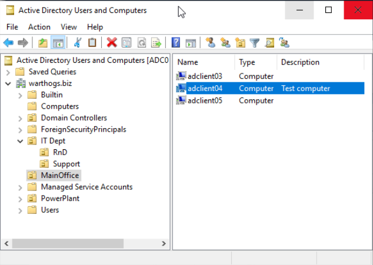
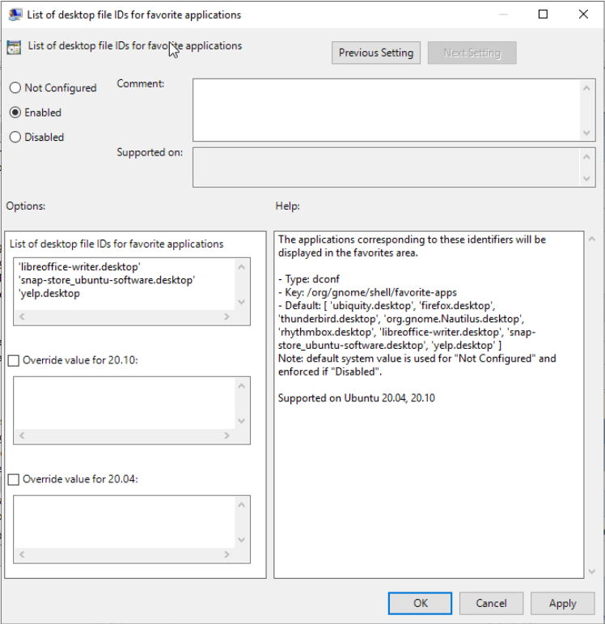
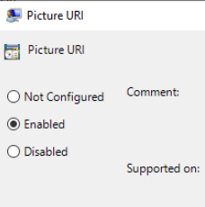
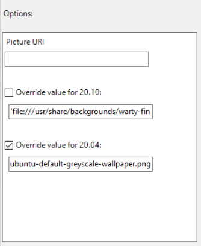
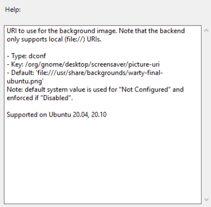
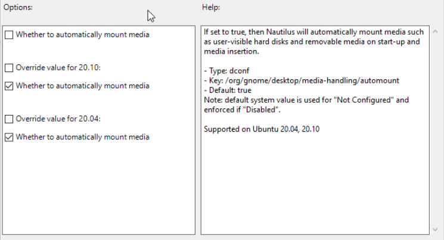

(howto::use-gpo)=
# How to use GPO with Ubuntu

There are two sets of Ubuntu specific settings in the Group Policy Management Editor:

* Machine policies: `[Policy Name] > Computer Configuration > Policies > Administrative Templates > Ubuntu`
* User policies: `[Policy Name] > User Configuration > Policies > Administrative Templates > Ubuntu`

This guide will demonstrate how to create GPO rules for changing dconf settings on the client:

* Computer setting: modify the background image shown in the greeter during login
* User setting: modify the preferred applications shown in the desktop application launcher

## Creating GPO rules

For this example, we will use a test domain called `warthogs.biz` with two separate Organizational Units (OUs).

The machine is called `adclient04` and belongs to `warthogs.biz > MainOffice`.



The user is called `bob` and belongs to `warthogs.biz > IT Dept > RnD`.


### Modifying a computer setting

Launch the GPO Management editor and create a GPO in `warthogs.biz > MainOffice`

1. Select GDM background picture setting in `Computer Configuration > Policies > Administrative Templates > Ubuntu > Login Screen > Interface > Picture URI`.
1. Select `Enabled` to enable the modification of the `Picture URI` field.
1. Enter a valid absolute path to a `.png` image on the client machine, e.g. `/usr/share/backgrounds/ubuntu-default-greyscale-wallpaper.png`.
1. Refresh the GPO rule on the client by rebooting the machine or running `adsysctl update -m` (You may be prompted to enter your password to check if have enough privileges to run the command).


Confirm that the change is now visible in the greeter.


```{note}
Files, such as images, are not copied by the Active Directory client and must already exist on the target system at the specified path.
```

### Modifying a user setting

1. Create another GPO in `warthogs.biz > IT Dept > RnD`.
1. Select the list of favorite desktop applications setting in `User Configuration > Policies > Administrative Templates > Ubuntu  > Desktop > Shell > List of desktop file IDs for favorite applications`.
1. Enter a list of valid `.desktop` file IDs on separate lines:

```
libreoffice-writer.desktop
snap-store_ubuntu-software.desktop
yelp.desktop
```



4. Refresh the GPO rule for the computer by running `adsysctl update` to refresh for your current user or `adsysctl update --all` for all active users.

```{tip}
Logging out and logging back in also triggers a GPO refresh for the current user.
```

The list of applications shown on the left side for your current Active Directory user should be updated:


## Explanation of GPOs for Ubuntu

There are multiple **policy managers** for different types of settings. As of now, only a **dconf** manager is available.

When settings are common to a machine and users, the machine settings will always take precedence over
the user ones.

The workflow to update a setting in the **GPO Management editor** and to apply the setting to a target user or machine is similar to Windows clients. However, we will see below that there are slight differences when the GPO are applied and refreshed between Windows and Ubuntu.

### When are GPO applied?

Any change to a GPO is applied:

* On boot for the machine settings
* On login for the user settings
* A periodic refresh timer will update the GPOs of the machine and all active users.

Next section will detail how to configure this and what happens when the Active Directory controller is unreachable.

### State of GPO settings

Most GPO rules can have three states: `enabled`, `disabled`, `not configured`. These states may have different meanings depending on the manager.



### General information of a setting

The **left pane** of the GPO Management Editor contains the options that can be edited when a setting is enabled.



There is a default value for all the releases and an override for each supported release of Ubuntu. More about multiple releases in the next section.

The **right pane** of the GPO Management editor contains the general information about the GPO including:

* The description of the setting
* The type of settings (e.g. dconf)
* The path of the key in our schema
* The default value of the key that is used if nothing is set on the left pane. Note that if defaults differ between releases, this will be a list per release.
* The list of releases that support this setting.



### Different types of widgets

#### Text entry

The type `Text` represents a single line of text. If you don’t enclose a string with single quotes `'` and the value is not a decimal, it will be done automatically and the entry will be sanitized  (e.g. space, `'`…). If you want to force a decimal to be treated as a string, enclose the value with single quotes.

The default value will be already set.


#### Text list

A multiline text field is used for this case. A list can be:


* One item per line: any end of line will be considered as a delimiter
Example:

```
libreoffice.desktop
firefox.desktop
nautilus.desktop
```

* Multiple items on one line: a coma `,` is the item delimiter:

```
libreoffice.desktop, firefox.desktop, nautilus.desktop
```

> Note that spaces will be stripped automatically.

* Both syntaxes can be combined:

```
libreoffice.desktop, firefox.desktop
nautilus.desktop
```

The type can be either text or numeric:

* Text list:

```
libreoffice.desktop
firefox.desktop
nautilus.desktop
```

* Decimal list:

```none
42
300
10
```

Ensure that you enter the valid type of list, as expected by dconf setting. ADSys will do its best to try to match the entry with the right and expected dconf type.

> String or decimal field ?
>
> The type of the value will be detected automatically and interpreted as a number if it contains only digits and no quotes, everything else is considered a string. If you want to enforce a list to have string entries, enclose each entry with single quotes.
>
>Text list:
>
>```none
>'42'
>'300'
>'10'
>```

#### Dropdown list

A list field is a limited list of values to choose from. It is represented by a drop down list.


#### Checkbox

A checkbox will correspond to  set to `true` or `false` values for the corresponding setting. The default value will be already selected.



#### Decimal

Decimal values are fields that allow only digits with optional upper and lower bounds. A spinner helps the user to increase or decrease the value.


The limits, if any, will be specified in the right section, per release.

### Multi-release support

**ADSys** supports setting different values for different releases of Ubuntu.

The top entry will set a common value between all clients, independently of the release it’s running on.

If you need to specify a per-release value for a set of clients, select the `Override` checkbox for the corresponding release and enter a value in the associated field. If the `Override` is checked, but no value is specified, the default value for this release will be used.

By definition, override takes precedence over the default value defined at the top for all the releases.

Finally, note that the help text on the right panel will list each default per release if they differ between themselves. In addition, it will list the supported releases for this setting.


> Multi-release overrides are only available when your Active Directory administrative templates defines more than one release. If this is not the case, you will only see the top entry to define your policy.
