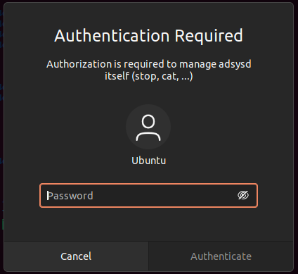

---
myst:
  html_meta:
    description: "Technical reference for the ADSys daemon (adsysd) including policy enforcement, caching, refresh rates, and configuration options."
---

# The adsys daemon

## Policy enforcement

On the client the policies are refreshed in three situations:

* At boot time for the policy of the machine.
* At login time for the policy of the user.
* Periodically by a timer for the machine and the user policy.

### Failed policy refresh and caching

When the client is offline, a user may still need to log in to the machine. 

For this purpose, ADSys uses a cache located in `/var/cache/adsys`.

```{admonition} Types of cache
:class: note

1. A cache for the GPO downloaded from the server in directory `gpo_cache`
2. A cache for the rules as applied by ADSys in directory `policies`
```

The enforcement of the policy will fail when the cache is empty or the client fails to retrieve the policy from the server.

If the enforcement of the policy fails:

* At boot time, ADSys stops the boot process.
* At login time, login is denied.
* During periodic refresh, the policy currently applied on the client remains.

### Policy refresh rate

Periodic refresh of the policies (machine and active users) is handled by the systemd timer unit `adsys-gpo-refresh.timer`.

Here is an example list of timers after running `systemctl list-timers`:


```{terminal}
:dir: 

systemctl list-timers

NEXT                         LEFT          LAST                         PASSED             UNIT                           ACTIVATES
Tue 2021-05-18 10:05:49 CEST 11min left    Tue 2021-05-18 09:35:49 CEST 18min ago          adsys-gpo-refresh.timer        adsys-gpo-refresh.service
Tue 2021-05-18 10:31:34 CEST 36min left    Tue 2021-05-18 09:31:09 CEST 23min ago          anacron.timer                  anacron.service
[...]

```

The default refresh rate is **30 minutes**.

Refresh rates are defined with the configuration variables `OnBootSec` and `OnUnitActiveSec`:


```{code-block} ini
:caption: /etc/systemd/system/adsys-gpo-refresh.timer.d/refresh-rate.conf
# Refresh ADSys GPO every two hours
[Timer]
OnBootSec=
OnBootSec=120min
OnUnitActiveSec=
OnUnitActiveSec=120min
```

Any changes to refresh rates are effective after a reload of the daemon.

You can confirm this by running `systemctl list-timers` after a reboot or after
running `systemctl daemon-reload`:

```{terminal}
:dir: 

sudo systemctl list-timers

NEXT                         LEFT          LAST                         PASSED             UNIT                           ACTIVATES
Tue 2021-05-18 10:35:45 CEST 16min left    Tue 2021-05-18 10:05:50 CEST 1h43min ago          adsys-gpo-refresh.timer        adsys-gpo-refresh.service
[...]
```

```{note}
The empty `OnBootSec=` and `OnUnitActiveSec=` statements are used to reset the system-wide timer unit time instead of adding new timers. `man systemd.timer` for more information.
```

Administrators can get more details about the timer status:

```{terminal}
:dir: 

sudo systemctl status adsys-gpo-refresh.timer

● adsys-gpo-refresh.timer - Refresh ADSys GPO for machine and users
     Loaded: loaded (/lib/systemd/system/adsys-gpo-refresh.timer; enabled; vendor preset: enabled)
     Active: active (waiting) since Tue 2021-05-18 08:35:48 CEST; 1h 23min ago
    Trigger: Tue 2021-05-18 10:05:49 CEST; 6min left
   Triggers: ● adsys-gpo-refresh.service

may 18 08:35:48 adclient04 systemd[1]: Started Refresh ADSys GPO for machine and users.
```

<!-- 
TODO: adsysctl service status to get next scheduled refresh
-->

## Socket activation

The ADSys daemon is started on demand by systemd’s socket activation and only runs when it’s required.

It will gracefully shutdown after idling for a short period of time (default: 120 seconds).

## Configuration

System-wide or user-specific configuration files can be created to modify the behavior of the daemon and the client:

* System-wide: defined in `/etc/adsys.yaml` and applies to both daemon and client.
* User-specific: defined in `$HOME/adsys.yaml` and applies only to the client for this user.

```{admonition} Other configuration options
:class: tip
The current directory is also searched for an `adsys.yaml` file.

A configuration file path can be passed to the the `adsysd` and `adsysctl` commands using the `--config|-c` flag
This may be especially useful for testing.
```

An example of configuration file is included in the [ADSys
repository](https://github.com/ubuntu/adsys/blob/main/conf.example/adsys.yaml)
and is shown below for reference.

```yaml
# Service and client configuration
verbose: 2
socket: /tmp/adsysd/socket

# Service only configuration
service_timeout: 3600
cache_dir: /tmp/adsysd/cache
run_dir: /tmp/adsysd/run

# Backend selection: sssd (default) or winbind
ad_backend: sssd

# Certificate enrollment method: cepces (default) or ldap
# If unset, defaults to cepces for backwards compatibility.
# New installations default to ldap.
certificate_enrollment: ldap

# SSSD configuration
sssd:
  config: /etc/sssd.conf
  cache_dir: /var/lib/sss/db

# LDAP transport used to retrieve GPOs (default: ldap)
#ldap_transport: ldap
ldap_tls_cacert: /etc/ssl/certs/ca-certificates.crt
# Optional CRL for strict TLS verification
#ldap_tls_crlfile: /path/to/ca-crl.pem

# Winbind configuration
# (if ad_backend is set to winbind)
winbind:
  ad_domain: domain.com
  ad_server: adc.domain.com

# Client only configuration
client_timeout: 60
```

### Configuration common between service and client

* **verbose**
Increase the verbosity of the daemon or client. By default, only warnings and error logs are printed. This value is set between 0 and 3. This has the same effect as the `-v` and `-vv` flags.

* **socket**
Path the Unix socket for communication between clients and daemon. This can be overridden by the `--socket` option. Defaults to `/run/adsysd.sock` (monitored by systemd for socket activation).

* **certificate_enrollment**

Method used for certificate enrollment. Can be either `cepces` (default) or `ldap`. This can be overridden by the `--certificate-enrollment` option.
New installations will be auto-configured to use `ldap`. If unset, defaults to `cepces` for backwards compatibility.

### Service only configuration

* **service_timeout**
Time in seconds without any active request before the service exits. This can be overridden by the `--timeout` option. Defaults to 120 seconds.

* **backend**
Backend to use to integrate with Active Directory. It is responsible for providing valid kerberos tickets. Available selection is `sssd` or `winbind`. Default is `sssd`. This can be overridden by the `--backend` option.

* **sss_cache_dir**
The directory that stores Kerberos tickets used by SSSD. By default `/var/lib/sss/db/`.

* **run_dir**
The run directory contains the links to the kerberos tickets for the machine and the active users. This can be overridden by the `--run-dir` option. Defaults to `/run/adsys/`.

#### Backend only options

##### SSSD

* **config**

Path `sssd.conf`. This is the source of selected sss domain (first entry in `domains:`), to find corresponding active directory domain section.

The option `ad_domain` in that section is used for the list of domains list of the host. `ad_server` (optional) is used as the Active directory LDAP server to contact. If it is missing, then the "Active Server" detected by sssd will be used.

Finally `default_domain_suffix` is used too, and falls back to the domain name if missing.

Default lookup path is `/etc/sssd/sssd.conf`. This can be overridden by the `--sssd.config` option.

* **cache_dir**

Path to the sss database to find the HOST kerberos ticket. Default path is `/var/lib/sss/db`. This can be overridden by the `--sssd.cache-dir` option.

##### Winbind

* **ad_domain**

A custom domain can be used to override the C API call that ADSys executes to determine the active domain -- which is returned by the `wbinfo --own-domain` (e.g. `example.com`)

* **ad_server**

A custom domain controller can be used to override the C API call that ADSys executes to determine the AD controller FQDN -- which is returned by `wbinfo --dsgetdcname domain.com` (e.g. `adc.example.com`).

### GPO configuration

* **gpo_list_timeout**

Maximum time in seconds for the GPO list to finish otherwise the GPO list is aborted. This can be overridden by the `--gpo-list-timeout` option. Defaults to 10 seconds. 

* **ldap_transport**

LDAP transport used to retrieve Group Policy Objects (GPOs). Valid values are
`ldap` (default), `ldaps`, `starttls`, and `auto`. The default preserves the
existing LDAP transport during upgrades (normally Kerberos-sealed LDAP on
port 389 unless Samba client settings enable TLS wrapping). ADSys uses
Kerberos SASL, which signs and seals LDAP operations after authentication;
the TLS transports support sites that block port 389 or require TLS-only LDAP.

`auto` is opt-in. It uses `ldaps` when `ad_use_ldaps = true` in the first
configured SSSD domain and `ldap` otherwise. With the winbind backend, `auto`
uses `ldap`; configure `ldap_transport` explicitly if the site requires LDAPS
or StartTLS.

`ldaps` connects to the domain controller on port 636 and to the Global Catalog
on port 3269. `starttls` upgrades LDAP connections on ports 389 and 3268.
Neither transport falls back to LDAP. Client-side LDAPS channel bindings were
added in Samba 4.20.3 (bug 15621). Earlier Samba versions can use explicit
`ldaps://` URLs, but do not send channel bindings; this can fail when a domain
controller requires channel binding. The `starttls` and `ldaps` values for
Samba's `client ldap sasl wrapping` option require Samba 4.21 or later.

The domain controller's issuing CA must already be trusted before the first
GPO retrieval. ADSys fetches GPOs before applying certificate policies, so a
certificate policy cannot bootstrap trust for the initial connection. The
default CA bundle is `/etc/ssl/certs/ca-certificates.crt`; configure
`ldap_tls_cacert` when the domain controller's CA is not in that bundle.
ADSys does not read SSSD's `ldap_tls_cacert` or `ldap_tls_cacertdir`; set
`ldap_tls_cacert` to the same CA file if SSSD uses a CA that is not in the
system bundle. Trust-file paths must be absolute.

Samba client settings from `/etc/samba/smb.conf` also apply. Samba's
`system_session()` loads that file into its process-global configuration
before the LDAP session is opened. In `ldaps` and `starttls` modes, ADSys sets
`tls cafile` and `tls verify peer`, sets `tls crlfile` when configured, and
sets `client ldap sasl wrapping = starttls` for StartTLS; these values
override the corresponding `smb.conf` settings. Other Samba TLS settings,
including `tls trust system cas`, `tls ca directories`, and `tls priority`,
still apply. In `ldap` mode ADSys does not set a wrapping option, so on Samba
4.21 or later an `smb.conf` setting of
`client ldap sasl wrapping = ldaps` or `starttls` can upgrade the connection
using Samba's `smb.conf` TLS trust.

* **ldap_tls_cacert**

Path to the PEM CA bundle used to verify the domain controller certificate
when `ldap_transport` is `ldaps` or `starttls`. Defaults to
`/etc/ssl/certs/ca-certificates.crt`. The path must be absolute. This option
is independent of the SSSD `ldap_tls_cacert` and `ldap_tls_cacertdir` options.

* **ldap_tls_crlfile**

Optional path to a PEM certificate revocation list. When set, Samba uses
`as_strict_as_possible` peer verification with this CRL. Without a CRL,
verification uses `ca_and_name`. The path must be absolute and the file must
be PEM encoded. Active Directory Certificate Services commonly publishes
DER-encoded `.crl` files; convert them to PEM before configuring this option.

### Client only configuration

* **client_timeout**
Maximum time in seconds between two server activities before the client returns and aborts the request. This can be overridden by the `--timeout` option. Defaults to 30 seconds.

## Debugging with logs (cat command)

It is possible to follow the exchanges between all clients and the daemon with the `cat` command. It forwards all logs and message printing from the daemon alone.

Only privileged users have access to this information. As with any other command, the verbosity can be increased with `-v` flags (it’s independent of the daemon or client current verbosity). More flags increases the verbosity further up to 3.

More information is available in the [adsysctl reference](adsysctl.md).

## Authorizations

ADSys uses a privilege mechanism based on polkit to manage authorizations. Many commands require elevated privileges to be executed. If the adsys client is executed with insufficient privileges to execute a command, the user will be prompted to enter its password. If allowed then the command will be executed and denied otherwise.



This is configurable by the administrator as any service controlled by polkit. For more information `man polkit`.

## Additional notes

There are additional configuration options matching the adsysd command line options. Those are used to define things like dconf, apparmor, polkit, sudo directories. Even though they exist mostly for integration tests purposes, they can be tweaked the same way as other configuration options for the service.

## Further information

Use the shell completion and the `help` subcommands to get more information.
